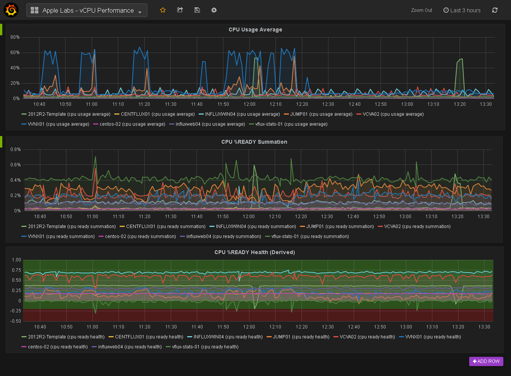

# vFlux-Stats-Kit
PowerCLI scripts to gather VMware performance stats and write them to InfluxDB.

## Introduction
Welcome to the vFlux Stats kit.  Use these scripts to gather VMware Sphere performance stats and write them to the InfluxDB time series database.  Then, display your metrics in all their glory through the Grafana web interface.

## Versions
This kit supports the latest InfluxDB v0.11 and latest Grafana 2.6, on both Windows or Linux.  For best performance use the latest Powershell and PowerCLI.

## VMware VSAN
This kit does not support VMware VSAN stats.  If you need those feel free to write your own using the API or use the amazing and simple pre-made appliance by [Sexi Graf](http://www.sexigraf.fr/).

## Requirements
You'll need at least one Windows box with VMware PowerCLI installed.  This should be a dependable device as you will likely run this as a scheduled task. 

As for InfluxDB and Grafana, they can be installed on Windows if desired (see my [How To Guide - Compiling InfluxDB on Windows](http://www.vmkdaily.com/posts/how-to-guide-compiling-influxdb-on-windows)).  If you want to run them on CentOS 7, check out my write up at:
http://vmkdaily.ghost.io/influxdb-and-grafana-on-centos/

## Inspiration
This project was inspired by (but not based on) a post by @chriswahl with his [Building a dashboard with grafana and powercli](http://wahlnetwork.com/2015/04/29/building-a-dashboard-with-grafana-influxdb-and-powercli/) and [the associated github content](https://github.com/WahlNetwork/grafana-vsphere-lab).  Some really nice Powershell doing JSON writes to v0.8.  However, by the the time I got to try that, the JSON writes were deprecated for InfluxDB Line Protocol.

So next, I stumbled upon some great prior art from @willemdh known as [naf windows perfmon to influxdb](https://github.com/willemdh/naf_windows_perfmon_to_influxdb/blob/master/naf_windows_perfmon_to_influxdb.ps1). His work, is based on [Graphite Powershell Functions](https://github.com/MattHodge/Graphite-PowerShell-Functions) by @MattHodge.  I borrowed their technique for performing InfluxDB writes using curl.exe for Windows.

I also use some hashing techniques from Luc Dekens.

## Room for Optimization
This thing actually performs reasonably well.  However, there is _plenty_ of room for optimization.  

**On the Powershell side**

These scripts (`vFlux-IOPS.ps1` and `vFlux-Compute.ps1`) are intentionally simple to show what is possible.  They deviate a bit from my normal get-stat scripts in that I'm not using `Group-Object` and not doing `get-stat` in one go; this is for the sake of simplicity in this case.  

**On the InfluxDB side**  

This could be optimized by pushing more data at once.  Optionally, review the use of native Powershell web services instead of curl.exe.  Also worth reviewing is Telemetry from Influxdata, I just haven't gotten to that one yet.

## Timings for Scheduled Tasks
You'll have to test how long it takes for your infrastructure.  A lab on SSD for example will finish quickly and all script options can be run every minute.  On a larger infrastructure, such as 600 VMs or so, and if targeting an older vCenter such as 5.1, you should be able to safely schedule these once every 15 mintues or so.

It's up to you how granular you want the stats.  You can modify the scripts, for example to only target one cluster, datastore, or set of VMs, etc.  I intentionally did not add those features here to keep it simple.  We gather all metrics.

*Note:  You do have the option to ignore ISO and Local datastores, but that's about it currently.*

## About %READY
CPU %READY is the time a guest operating system wanted to exectute a CPU instruction but had to wait.  Commonly acceptable %READY time is .10 to .20 per vCPU.  So a Two vCPU VM could have a %READY time of .40 before being an issue, for example.  Of course, tolerance to this type of compute latency is workload dependent and some shops follow the strictest tolerance of 5% or less.

## About %READY Health (Derived)
I created a derived metric called %READY Health.  It multiplies the "acceptable" %READY tolerance by the number of vCPUs.  So when you see a VM with a %READY time of .80, unless you go look up how many vCPUs it has, you don't know if that's ok or terrible.  This metric will do the calculation and return the difference between the max tolerance and the current reading.  It then writes that extra derived metric to InfluxDB.

In the above example of %READY of .80, if the VM has 8 vCPU, it's %READY health will be .80.  This is the difference between 8 * .20 and the current reading of .80.

## My Guides
[How To Guide - Installing InfluxDB and Grafana on CentOS 7](http://vmkdaily.ghost.io/influxdb-and-grafana-on-centos/) 
How To Guide - Deploying InfluxDB and Grafana on Windows [coming soon] 
How To Guide - Customizing Charts in Grafana [coming soon] 

## Stat Gallery
Following are some dashboards examples.
 

 

 

 

Mike 
@vmkdaily
